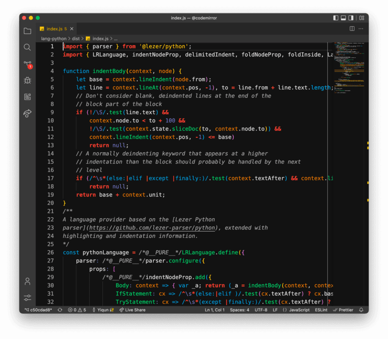

# Brogrammer Plus

An improved Brogrammer theme with semantic highlighting, WCAG AAA text color, companion terminal themes, and material-designed UI.

一款改进的 Brogrammer 主题，拥有语义高亮功能、符合 WCAG AAA 文本配色、配套的终端主题、以及符合 Material Design 的界面设计。

## Features / 功能

### 1. Semantic highlighting / 语义高亮

Supports [sematic highlighting](https://code.visualstudio.com/api/language-extensions/semantic-highlight-guide), which utilizes the language server to get an improved and refined highlighting result.

支持[语义高亮](https://code.visualstudio.com/api/language-extensions/semantic-highlight-guide)，能够利用 language server 取得更为精细和完善的高亮效果。

### 2. WCAG AAA text color / 符合 WCAG AAA 文本配色

Built with [WCAG AAA standard](https://webaim.org/resources/contrastchecker/) in mind, which requires a contrast ratio of at least 7:1 for good readibility. Besides, the theme also follows the [Matrial Design Text Legibility](https://material.io/design/color/text-legibility.html#text-backgrounds) guide.

设计时考虑了 [WCAG AAA 标准](https://webaim.org/resources/contrastchecker/)，通过至少 7：1 的对比度来提供良好的可读性。此外，该主题还遵循了 [Material Design 文本可读性指南](https://material.io/design/color/text-legibility.html#text-backgrounds)。

### 3. Companion terminal themes / 配套的终端主题

Provides companion terminal themes for both integrated terminal and [external terminals](https://github.com/jackjyq/iTerm2-Color-Schemes).

提供适用于集成终端和[外部终端](https://github.com/jackjyq/iTerm2-Color-Schemes)的配套终端主题方案。

### 4. Material-designed UI / 符合 Material Design 的界面设计

The UI is designed according to the [Matrial Design Dark Theme](https://material.io/design/color/dark-theme.html#properties) guide.

该用户界面的设计遵循了 [Material Design 深色主题指南](https://material.io/design/color/dark-theme.html#properties)。

## Color Palette / 配色

### Text colors / 文本颜色

| High Emphasis | Medium Emphasis | Disabled  |
| ------------- | --------------- | --------- |
| #FFFFFFDE     | #FFFFFF99       | #FFFFFF61 |

### Highlighting colors / 高亮颜色

| Red     | Orange  | Yellow  | Green   | Cyan    | Blue    | Magenta |
| ------- | ------- | ------- | ------- | ------- | ------- | ------- |
| #E74C3C | #E67E22 | #F1C40F | #2ECC71 | #3CC9D6 | #3498DB | #6C71C4 |

## UI colors / 界面颜色

| 00dp    | 01dp    | 02dp    | 03dp    | 04dp    | 08dp    | 12dp    | 16dp    | 24dp    |
| ------- | ------- | ------- | ------- | ------- | ------- | ------- | ------- | ------- |
| #121212 | #1E1E1E | #222222 | #242424 | #262626 | #2E2E2E | #323232 | #363636 | #383838 |

## [Screenshots](./img/origin/) / [截图](./img/origin/)

Click the image to view the high resolution version.

点击截图，查看高清版本。

## Attributions / 鸣谢

The color schema is derived from [Theme-Brogrammer](https://github.com/gerane/VSCodeThemes/tree/master/gerane.Theme-Brogrammer), which is said to be ported from Brogrammer TextMate Theme.

该颜色方案源自 [Theme-Brogrammer](https://github.com/gerane/VSCodeThemes/tree/master/gerane.Theme-Brogrammer)，据说是从 Brogrammer TextMate 主题移植而来。
