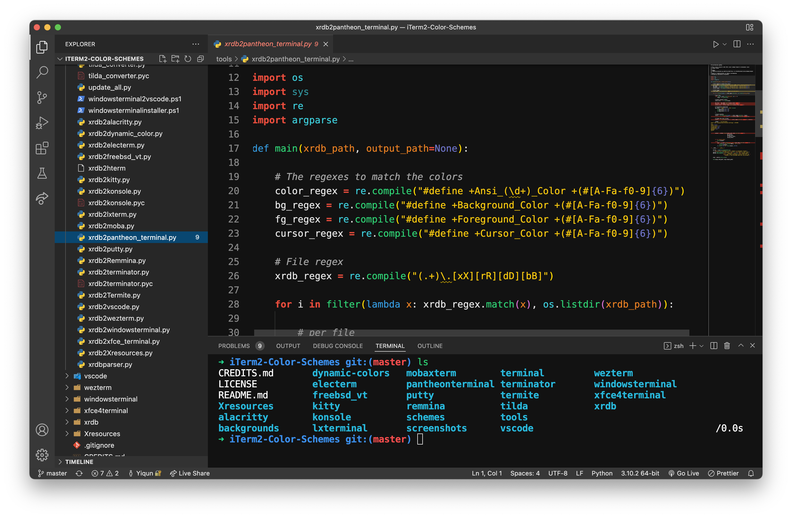

# Brogrammer Plus VS Code theme

A brogrammer theme with semantic highlighting and more

## Feature

- [Brogrammer color](https://github.com/gerane/VSCodeThemes/tree/master/gerane.Theme-Brogrammer)
- [Semantic highlighting](https://code.visualstudio.com/api/language-extensions/semantic-highlight-guide)
- [Material design](https://material.io/design/color/dark-theme.html)

## Color Palatte

### Text Color

- High Emphasis: #ffffffde
- Medium Emphasis: #ffffff99
- Disabled: #ffffff61

### Background Color
- 00dp: #121212
- 01dp: #1E1E1E
- 02dp: #222222
- 03dp: #242424
- 04dp: #262626
- 08dp: #2E2E2E
- 12dp: #323232
- 16dp: #363636
- 24dp: #383838

### Highlighting Color
- Red: #e74c3c
- Yellow: #f1c40f
- Green: #2ecc71
- Cyan: #3cc9d6
- Blue: #3498db
- Magenta: #6c71c4
- Orange: #e67e22

## Related theme

- [Brogrammer Plus terminal themes](https://github.com/jackjyq/iTerm2-Color-Schemes)

## Acknowledgements

- [Brogrammer VS Code theme](https://github.com/gerane/VSCodeThemes/tree/master/gerane.Theme-Brogrammer)
