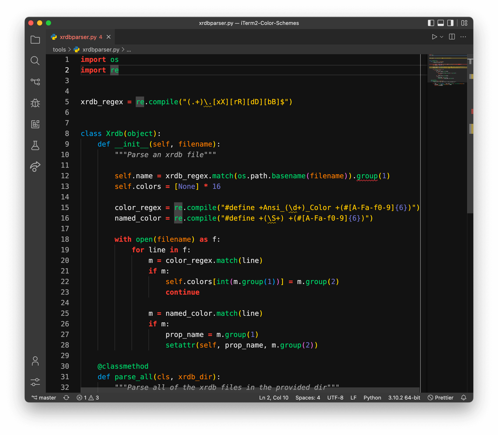

# Brogrammer Plus

[](https://marketplace.visualstudio.com/items?itemName=jackjyq.brogrammer-plus)

> A Brogrammer theme with [Material Design](https://material.io/design/color/dark-theme.html), [Semantic Highlighting](https://code.visualstudio.com/api/language-extensions/semantic-highlight-guide) and more


## Screenshots

<h3 align="center">Python</h3>



<h3 align="center">JavaScript</h3>


<h3 align="center">HTML</h3>


<h3 align="center">Terminal</h3>


<h3 align="center">Workspace</h3>


## Suggested Font

- Terminal font: [DejaVu Sans Mono](https://dejavu-fonts.github.io/Download.html)
- Editor font: [Cascadia Mono](https://github.com/microsoft/cascadia-code/releases)

```json
{
  "editor.fontFamily": "'DejaVu Sans Mono'",
  "terminal.integrated.fontFamily": "'Cascadia Mono'"
}
```

## Color Palatte

### Text Color

- High Emphasis: #ffffffde
- Medium Emphasis: #ffffff99
- Disabled: #ffffff61

### Background Color

- 00dp: #121212
- 01dp: #1E1E1E
- 02dp: #222222
- 03dp: #242424
- 04dp: #262626
- 08dp: #2E2E2E
- 12dp: #323232
- 16dp: #363636
- 24dp: #383838

### Highlighting Color

- Red: #e74c3c
- Orange: #e67e22
- Yellow: #f1c40f
- Green: #2ecc71
- Cyan: #3cc9d6
- Blue: #3498db
- Magenta: #6c71c4

## Acknowledgements

- [Theme-Brogrammer](https://github.com/gerane/VSCodeThemes/tree/master/gerane.Theme-Brogrammer)

## Related project

- [Brogrammer Plus for terminal](https://github.com/jackjyq/iTerm2-Color-Schemes)
